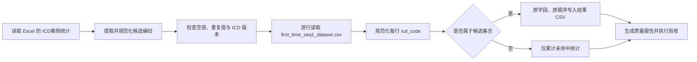

# 基于 ICD 候选编码筛选首诊数据的设计方案

## 1. 目标

以 `mimic-iv-3.1/ICD_code_selected.xlsx` 为唯一的 ICD 候选编码依据，从 `data_output/first_time_seq1_dataset.csv` 中筛选 `icd_code` 属于候选集合的记录。

本方案将“包含在”定义为：**规范化后的 ICD 编码精确集合匹配**，不采用前缀、子串或模糊匹配。例如，候选编码 `K831` 只匹配 `K831`（或规范化前的 `K83.1`），不匹配 `K8310`。

原始 Excel 和 CSV 均保持只读；筛选结果另存为新文件。

## 2. 数据源核对结果

### 2.1 ICD 候选编码工作簿

- 文件：`mimic-iv-3.1/ICD_code_selected.xlsx`
- 权威数据表：`ICD案例统计`
- 权威编码列：`ICD编码（原始）`
- 辅助展示列：`ICD编码（标准显示）`
- 数据行数：574
- 规范化后唯一编码数：574
- 空编码数：0
- 重复编码数：0
- ICD 版本：全部为 `10`
- `ICD编码（原始）` 当前已采用无小数点格式，例如 `K7031`

`汇总` 工作表仅用于统计展示，不作为候选编码读取范围。

### 2.2 待筛选 CSV

- 文件：`data_output/first_time_seq1_dataset.csv`
- 字段顺序：`subject_id`、`hadm_id`、`admittime`、`seq_num`、`icd_code`、`icd_version`
- 数据行数：92,133（不含表头）
- 字段数：6
- 空 `icd_code`：0
- 唯一 `icd_code`：6,641
- `icd_version`：全部为 `10`
- `seq_num`：全部为 `1`
- `subject_id` 和 `hadm_id` 在当前文件中均无重复
- `icd_code` 当前不存在小数点、小写字母或首尾空白
- 未发现列数异常的记录

### 2.3 当前预期筛选基线

| 指标                        |   预期值 |
| --------------------------- | -------: |
| 输入记录数                  |   92,133 |
| 命中记录数                  |   11,690 |
| 未命中记录数                |   80,443 |
| 记录命中率                  | 12.6882% |
| 实际命中的候选编码数        |      517 |
| 未在 CSV 中出现的候选编码数 |       57 |
| 候选编码覆盖率              | 90.0697% |

直接精确匹配与规范化后匹配当前均得到 11,690 行；规范化规则主要用于兼容未来文件中可能出现的小数点、大小写或首尾空白差异。

## 3. 匹配规则

### 3.1 编码读取

1. 从 `ICD案例统计` 工作表的 `ICD编码（原始）` 列读取候选编码。
2. 将 Excel 编码按文本读取，禁止转换为数值。
3. 去除空值后构造唯一编码集合；若出现空值或规范化后重复值，则终止处理并报告。

### 3.2 统一规范化

候选编码和 CSV 的 `icd_code` 使用同一函数规范化：

```text
normalize_icd(value) = upper(trim(string(value))).replace(".", "")
```

规范化仅处理：

- 首尾空白；
- 英文字母大小写；
- ICD 显示格式中的小数点。

不删除连字符或其他未知字符，避免错误地把非法值变成合法编码。规范化后建议以 `^[A-Z][A-Z0-9]{2,6}$` 做格式检查；异常值进入质量报告，不进行模糊修复。

### 3.3 筛选条件

```text
normalize_icd(CSV.icd_code) in selected_icd_code_set
```

`icd_version` 不作为额外业务筛选条件，但必须进行一致性检查。由于候选工作簿全部是 ICD-10，若后续输入 CSV 出现非 `10` 版本，应停止处理并人工确认，避免不同版本的同名编码发生误匹配。

## 4. 处理流程



推荐使用 Python 标准库的 `csv` 模块流式处理。候选集合只有 574 个编码，可常驻内存；CSV 逐行读取和写出，内存占用稳定，也不会改变原始字段内容。

## 5. 输出设计

建议实现阶段生成以下文件：

- 筛选结果：`data_output/first_time_seq1_dataset_icd_selected.csv`
- 质量报告：`data_output/first_time_seq1_dataset_icd_selected_qc.json`

结果 CSV 应满足：

- 保留输入 CSV 的全部 6 个字段和原始字段顺序；
- 保留输入记录的相对顺序；
- 不覆盖或重写原始 CSV；
- 仅将规范化用于比较，不修改输出中的原始 `icd_code`；
- 使用 UTF-8 编码并写出一次表头。

质量报告至少记录：

- 输入、输出和未命中行数；
- 候选编码总数、命中编码数和未出现编码清单；
- 空值、非法格式、重复候选编码和 ICD 版本分布；
- 输入/输出文件路径、文件大小和生成时间；
- 可选的输入文件 SHA-256，便于结果追溯。

## 6. 异常处理

以下情况采用“失败即停止”，不静默跳过：

- Excel 文件、目标工作表或权威编码列不存在；
- CSV 不存在 `icd_code` 列；
- 候选集合为空；
- 候选编码规范化后出现空值或重复值；
- 输入出现非 ICD-10 版本；
- CSV 行字段数与表头不一致；
- 输出路径与任一输入路径相同。

CSV 中个别空或格式非法的 `icd_code` 可以不写入结果，但必须计入质量报告；若数量大于 0，最终任务状态应标记为“完成但需复核”。

## 7. 验收标准

基于当前两份源文件，首次实现应全部通过以下检查：

1. 输出记录数为 **11,690**，加上未命中记录 **80,443**，等于输入总数 **92,133**。
2. 输出中每一行的规范化 `icd_code` 都属于 574 个候选编码集合。
3. 输入中每一行属于候选集合的记录都出现在输出中，即无漏选。
4. 输出共有 **517** 个唯一命中编码；另有 **57** 个候选编码在当前 CSV 中未出现。
5. 输出列名、列顺序和字段数与输入完全一致。
6. 输出记录的相对顺序与输入一致。
7. 输入 Excel 和 CSV 的修改时间及内容不因处理而变化。
8. 使用直接精确匹配与规范化匹配进行交叉核对，当前两者都应得到 **11,690** 行。

## 8. 实施边界

本任务只做 ICD 编码集合筛选，不额外进行疾病层级扩展、父子编码推断、描述文本匹配、患者去重或住院去重。当前 CSV 已经是一位患者/一次住院对应一条 `seq_num = 1` 记录；筛选阶段仍应原样保留记录，不改变这一数据粒度。
